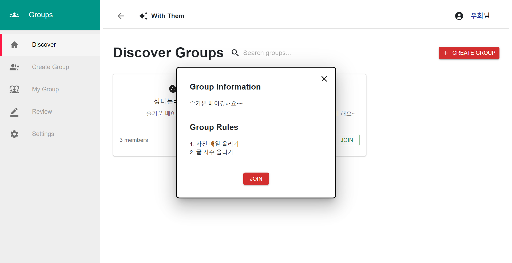
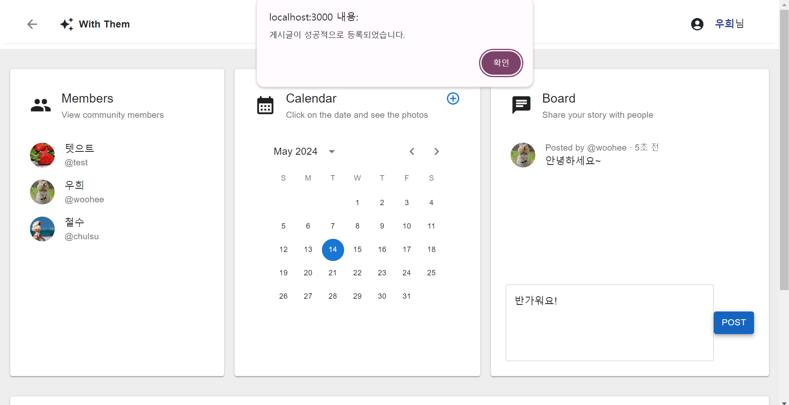

# 👥 with-them 👥

         

 

## 🌟 프로젝트 개요

### 🎯 목표

사용자가 회원가입 및 로그인을 통해 그룹을 생성하고 참여하는 웹 애플리케이션을 개발했습니다. 
그룹 내에서 사진 공유, 게시판 활동 등의 기능을 제공하고, 사용자 정보 변경과 리뷰 제공 기능을 포함하였습니다.

### 🛠️ 기술스택

- **프론트엔드**: React
- **백엔드**: Node.js, Express
- **데이터베이스**: MySQL
- **인증**: Passport.js
- **파일 업로드**: AWS S3, Multer
- **환경 변수 관리**: dotenv
- **세션 관리**: express-session

 

## 🚀 주요 기능

1. **🔑 회원가입 및 로그인**
    - 사용자는 아이디, 비밀번호, 닉네임을 통해 회원가입을 할 수 있습니다.
    - Passport.js를 이용한 로컬 전략 인증을 통해 사용자가 로그인할 수 있습니다.

2. **👥 그룹 생성 및 관리**
    - 사용자는 그룹을 생성하고, 그룹 정보(그룹명, 그룹 설명 등)를 입력할 수 있습니다.
    - 생성된 그룹에 가입하고 탈퇴할 수 있습니다.
    - 그룹 내에서 규칙을 설정하고, 이를 그룹 구성원에게 공유할 수 있습니다.

3. **✍️ 리뷰 작성 및 조회**
    - 사용자는 리뷰를 작성하고, 첫 화면에서 다른 사용자의 리뷰를 조회할 수 있습니다.
    - 리뷰는 랜덤으로 정렬되어 상위 4개의 리뷰만 화면에 표시됩니다.

4. **📋 게시판 기능**
    - 그룹별 게시판을 통해 사용자는 글을 작성하고, 최근 일주일 내의 글을 조회할 수 있습니다.

5. **📅 달력 기능**
    - 사용자는 특정 날짜에 사진을 업로드하고, 해당 날짜의 사진을 조회할 수 있습니다.

6. **👤 사용자 프로필 관리**
    - 사용자는 닉네임과 프로필 사진을 업데이트할 수 있습니다.
    - 닉네임 중복 확인 기능을 통해 중복된 닉네임을 방지합니다.

 

## 📸 스크린샷

### 🌐 메인 화면

### 🔍 디테일 화면

 

## 🛠️ 개발 과정

1. **🔧 초기 설정 및 환경 구성**
    - Node.js와 Express를 설치하고 기본 서버를 설정합니다.
    - MySQL 데이터베이스와의 연결을 설정합니다.
    - 환경 변수를 관리하기 위해 dotenv를 설정합니다.

2. **🔐 회원가입 및 로그인 기능 구현**
    - Passport.js를 이용한 로컬 전략 인증을 설정합니다.
    - 사용자 세션 관리를 위해 express-session을 설정합니다.
    - bcrypt를 사용하여 비밀번호를 암호화합니다.

3. **👥 그룹 생성 및 관리 기능 구현**
    - 그룹 생성, 조회, 가입 기능을 구현합니다.
    - 그룹 규칙을 설정하고 저장하는 기능을 추가합니다.

4. **✍️ 리뷰 작성 및 조회 기능 구현**
    - 리뷰 작성 API와 랜덤으로 리뷰를 조회하는 기능을 구현합니다.

5. **📋 게시판 기능 구현**
    - 게시판 글 작성 및 조회 기능을 구현합니다.
    - 최근 일주일 내의 글만 조회하도록 제한합니다.

6. **📅 달력 기능 구현**
    - 사용자가 특정 날짜에 사진을 업로드하는 기능을 구현합니다.
    - AWS S3와 Multer를 사용하여 파일 업로드를 처리합니다.

7. **👤 사용자 프로필 관리 기능 구현**
    - 닉네임 변경 및 프로필 사진 업데이트 기능을 구현합니다.
    - 닉네임 중복 확인 기능을 추가합니다.

8. **🔗 프론트엔드와의 연동**
    - React로 구성된 프론트엔드와 백엔드를 연동하여 전체적인 애플리케이션을 완성합니다.

 

## ⚠️ 어려웠던 부분과 해결 과정

1. **🗂️ 파일 업로드와 AWS S3 연동**
    - 초기에는 Multer와 AWS S3를 이용한 파일 업로드 과정에서 여러 가지 어려움이 있었습니다. 문제를 해결하기 위해 다음과 같은 과정을 거쳤습니다. 첫째, AWS IAM 사용자 권한을 재설정하여 S3 버킷에 접근할 수 있는 사용자의 읽기/쓰기 권한을 부여했습니다. 둘째, Multer-S3 설정을 재검토하여 파일 업로드 경로와 S3 버킷 이름을 정확히 설정했습니다. 셋째, 다양한 테스트 케이스를 통해 파일 업로드 기능을 점검하였습니다. 이를 통해 설정이 제대로 적용되었는지 확인하고, 문제를 조기에 발견하여 해결할 수 있었습니다.

2. **🗃️ 데이터베이스 연동과 쿼리 작성**
    - MySQL 데이터베이스와의 연동 과정에서 복잡한 쿼리를 작성하는 데 어려움을 겪었습니다. 특히, 여러 테이블 간의 Join과 Subquery를 작성하는 과정에서 성능 저하와 데이터 불일치 문제가 발생했습니다. 이를 해결하기 위해 쿼리 최적화를 적극적으로 진행했습니다. Join과 Subquery를 효율적으로 활용하여 복잡한 쿼리를 최적화함으로써 데이터베이스 쿼리 성능을 개선하고 데이터 일관성을 유지했습니다. 다양한 테스트 케이스를 통해 쿼리의 정확성과 성능을 검증하여 데이터베이스 연동 과정에서 발생하는 문제를 조기에 발견하고 해결했습니다.
